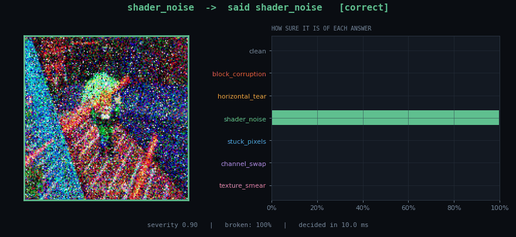
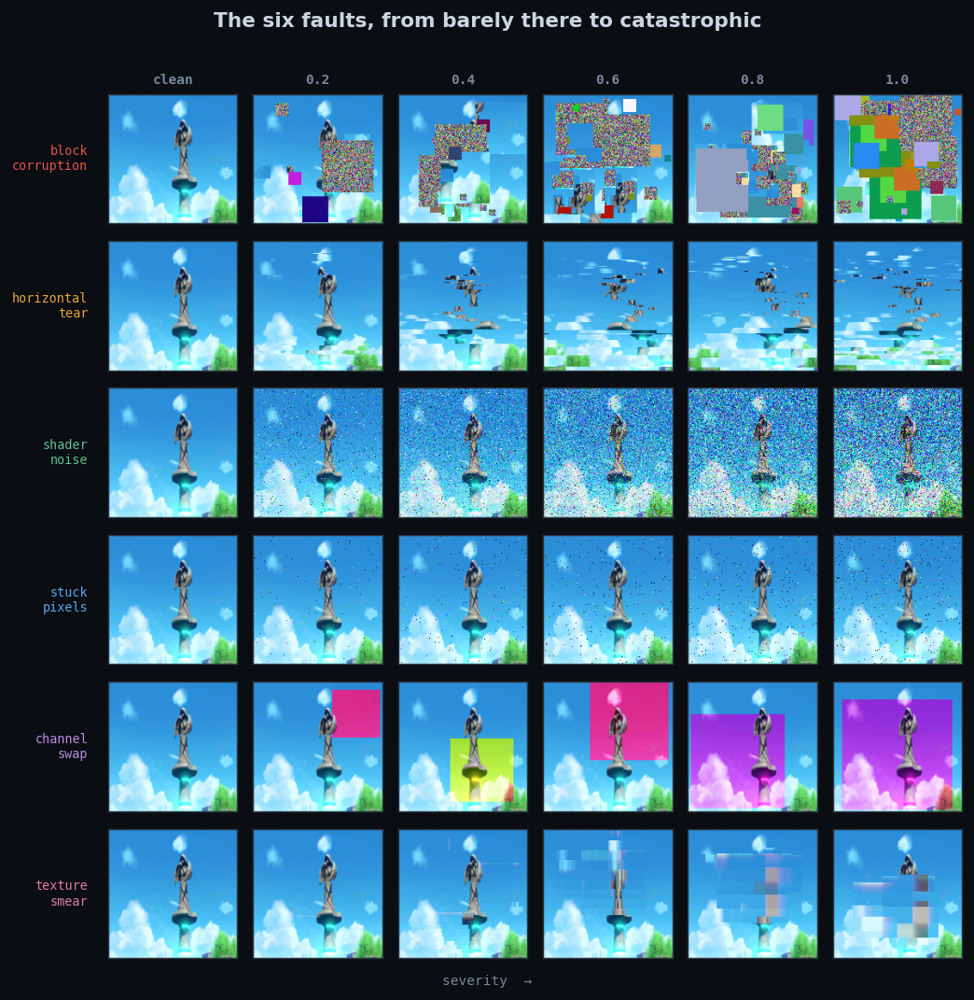
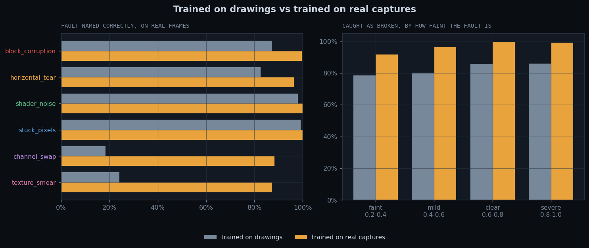
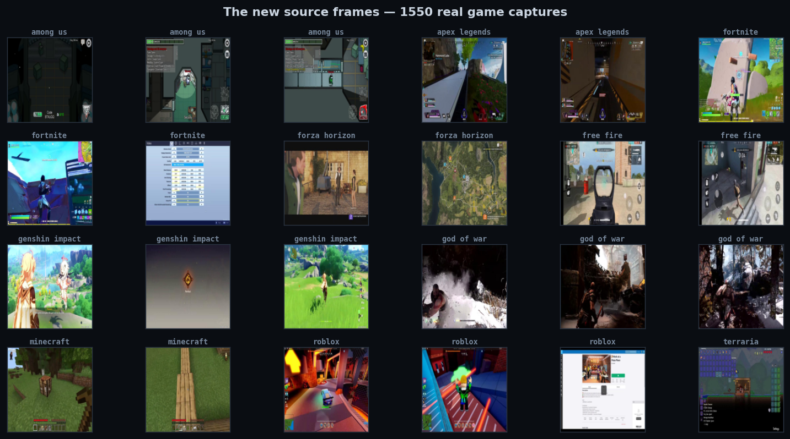
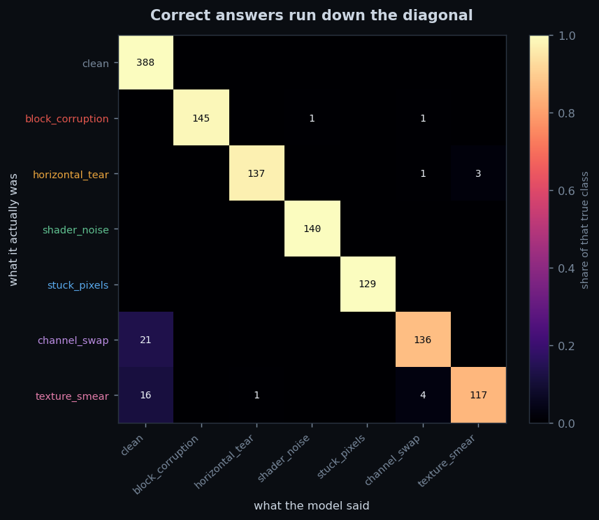
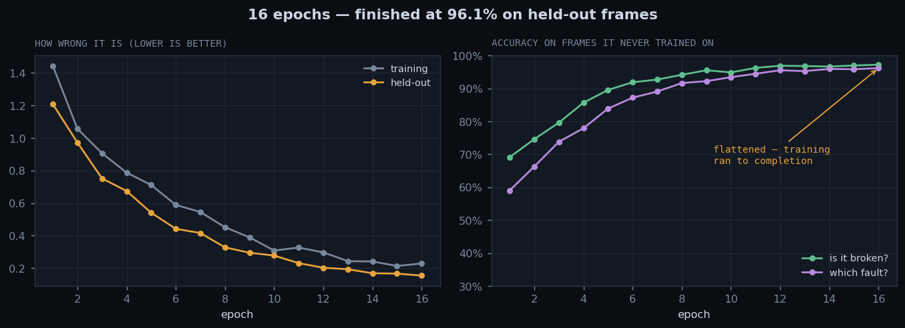
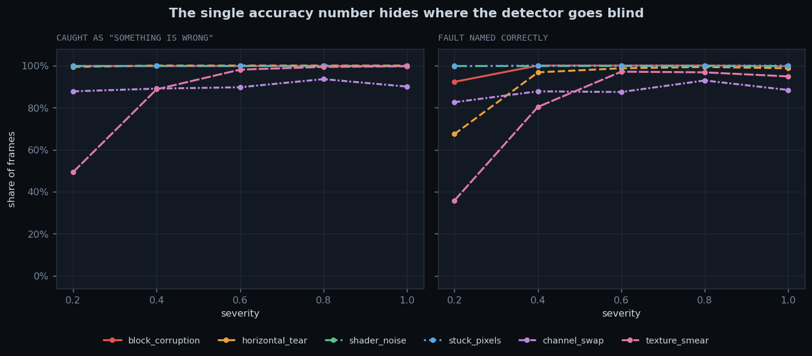
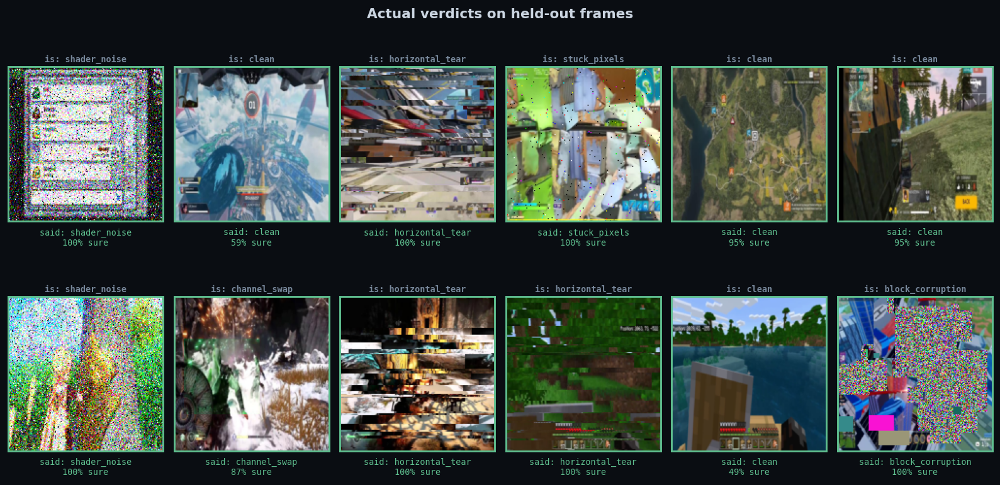
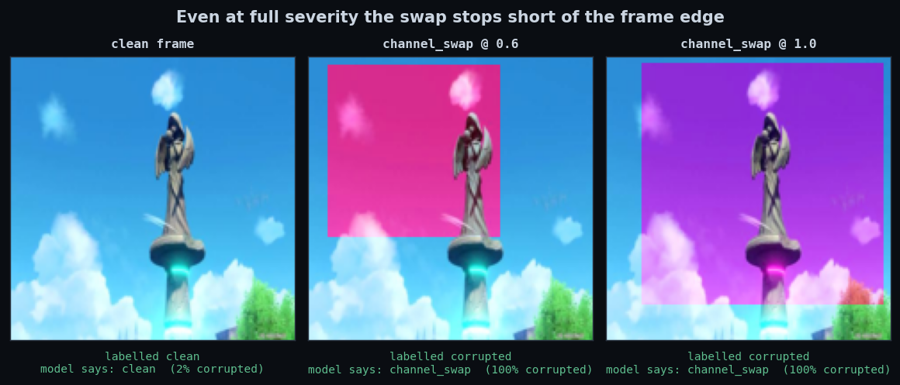

# Render Fault Detector

**A 1.2M-parameter CNN that looks at one rendered game frame and says whether the GPU
that drew it was misbehaving — and which way — in ~12 ms on a CPU.**

<p align="center">
  
</p>

Detecting visual corruption in rendered output is, today, mostly a person watching a
screen. This project builds the automated version end to end: a labelled corpus that did
not previously exist, a dual-head classifier trained on it, an evaluation harness that
measures the things which actually gate deployment, and a set of figures and a written
report that explain what the model learned and where it still fails.

It is a portfolio project, built to show the whole arc of an applied-ML problem — problem
framing, data strategy, model, evaluation, failure analysis, and communication — rather
than just a training script.

---

## Headline results

Judged on **1,240 held-out samples** built from **310 game-capture frames the model never
trained on**, with faults injected at seeded severities.

| | |
|---|---|
| Catches a broken frame (binary head) | **97.2 %** |
| Names the correct fault (7-way head) | **96.1 %** |
| False alarms on clean frames | **0 of 388** |
| Latency, batch 1, laptop CPU | **12.5 ms mean / 11.2 ms median — 80 FPS** |
| Latency, batch 32, laptop CPU | **9.5 ms per frame — 105 FPS** |
| Parameters | 1,175,529 |

Per-class recall on the held-out set:

| Class | Recall | Class | Recall |
|---|---|---|---|
| `clean` | 1.000 | `stuck_pixels` | 1.000 |
| `shader_noise` | 1.000 | `horizontal_tear` | 0.972 |
| `block_corruption` | 0.986 | `channel_swap` | 0.866 |
| | | `texture_smear` | 0.848 |

The full confusion matrix and latency distribution are committed in
[`checkpoints/pretrained/eval_metrics.json`](checkpoints/pretrained/eval_metrics.json).

The **zero false alarms** line is the operationally important one. An earlier version of
this model called 23 % of perfectly good frames broken; a detector that cries wolf on a
quarter of its input is a detector people switch off.

---

## See it for yourself

Everything below runs on CPU. No GPU required.

### 0. Clone and install

```bash
git clone https://github.com/joshwiersema/Image-Corruption-Model.git
cd Image-Corruption-Model
python -m venv .venv
# Windows:       .venv\Scripts\activate
# macOS / Linux: source .venv/bin/activate
pip install -r requirements.txt
```

Python 3.10 or newer.

### 1. Read the report — no setup at all

[`visuals/report_v2.html`](visuals/report_v2.html) is a single self-contained page with
every figure inlined. Clone and open it in a browser, or download the raw file. It is the
fastest way to see what this project produced.

*(Optional: **Settings → Pages → Deploy from branch → `main` / `(root)`** serves it at
`https://joshwiersema.github.io/Image-Corruption-Model/visuals/report_v2.html`.)*

### 2. Run the trained model — about 10 minutes

The trained weights are committed at `checkpoints/pretrained/best.pt`, so there is nothing
to train. You do need the frames it was validated against:

```bash
# ~1,450 game-capture frames (~400 MB) from a CC-BY-4.0 Hugging Face dataset.
# The default count reproduces exactly the corpus the model was trained on.
python scripts/fetch_game_frames.py
```

Then pick any of these:

```bash
# Watch it work, one frame at a time, in a live window
python scripts/live_view.py --checkpoint checkpoints/pretrained/best.pt

# ...or record that same stream to a GIF instead of opening a window
python scripts/live_view.py --checkpoint checkpoints/pretrained/best.pt \
    --gif visuals/live_demo.gif --frames 36

# Reproduce the headline numbers: confusion matrix, per-class report, latency
python -m src.evaluate --checkpoint checkpoints/pretrained/best.pt \
    --clean-dir data/game_frames --samples-per-image 4 \
    --output-dir checkpoints/pretrained

# Re-render every figure in visuals/
python scripts/make_visuals.py --checkpoint checkpoints/pretrained/best.pt \
    --source-dir data/game_frames

# Rebuild the HTML report from those figures
python scripts/build_report.py --template scripts/report_v2_template.html \
    --output visuals/report_v2.html
```

> **In a hurry?** `python scripts/fetch_game_frames.py --count 300` downloads ~80 MB and is
> enough to watch the demo run — but it is a *different* corpus, so the train/val split no
> longer matches the one the shipped checkpoint was trained on. Use it to see the model
> work, not to quote accuracy numbers.

### 3. Train it yourself — about 55 minutes on CPU

```bash
python scripts/fetch_game_frames.py
python -m src.train --clean-dir data/game_frames --image-size 160 \
    --samples-per-image 4 --epochs 16 --batch-size 64 --lr 1e-3 \
    --checkpoint-dir checkpoints/mine --history-file checkpoints/mine/history.json
python -m src.evaluate --checkpoint checkpoints/mine/best.pt \
    --clean-dir data/game_frames --samples-per-image 4 \
    --output-dir checkpoints/mine
```

That is the exact recipe behind the shipped checkpoint. Everything is seeded, so the split
and the validation corruptions are reproducible.

Useful training flags: `--samples-per-image` (virtual epoch size), `--clean-ratio`
(fraction of samples left uncorrupted), `--severity-min` / `--severity-max`,
`--binary-loss-weight`, `--arch {small_cnn,resnet18}`, `--pretrained`,
`--freeze-backbone`, `--device {auto,cpu,cuda}`. Run `python -m src.train --help` for the
full list.

### 4. Run with no downloads at all

The pipeline also works on procedurally drawn frames, which is how the project started:

```bash
python scripts/make_demo_data.py --count 40 --preview   # instant, writes data/clean/
python -m src.train --epochs 10
python -m src.evaluate --checkpoint checkpoints/best.pt
```

Useful for checking that the code runs. It is *not* how you get the headline numbers — see
[Why real frames mattered](#why-real-frames-mattered).

---

## The problem, and why it needed solving this way

When a GPU misbehaves — unstable clocks, a bad memory write, a broken shader compilation,
a scanout desync — the failure surfaces as *visual* corruption in the rendered frame.
Automating that check matters because:

- **Validation runs at a scale nobody can eyeball.** A driver regression sweep renders
  millions of frames across thousands of configurations.
- **Exact golden-image comparison is too brittle.** Legitimate frames differ run to run
  from non-determinism, different filtering, and different precision paths.
- **Triage beats detection.** *Which* artifact appeared narrows the search: block
  corruption points at memory or compression, tearing at scanout and presentation, noise
  at shader execution, a channel swap at surface formats and swizzles. The multi-class
  head is what turns a red test into a lead.

The blocker is data. Real corrupted frames are rare, hard to reproduce, and expensive to
label — **no labelled corpus exists**. So the project makes one: take real game captures,
damage them in six ways that each imitate a distinct hardware failure, with a severity dial
from 0.2 (barely perceptible) to 1.0 (catastrophic). Because the program chose the damage,
the label is free and exact.

### The artifact taxonomy

| Class | Models | Visual signature |
|---|---|---|
| `block_corruption` | Bad memory write; compression block decoded with the wrong key | Tile-aligned rectangles of noise, flat wrong colour, or stale content copied from elsewhere |
| `horizontal_tear` | Scanout desync / missing vsync | Bands of scanlines displaced sideways, plus a full-frame tear seam at high severity |
| `shader_noise` | Unstable shader core; post-process fed invalid values | Dense high-frequency grain with blown-out speckle |
| `stuck_pixels` | Defective framebuffer or display cells | Sparse pixels latched to a saturated colour, or to black |
| `channel_swap` | Wrong surface format or swizzle descriptor (RGBA read as BGRA) | A region of the frame with its colour channels permuted |
| `texture_smear` | Stale texture fetch, unresolved sampler | Content dragged into hard directional bands with a fading trail |

Plus `clean` — index 0 — for uncorrupted frames.

<p align="center">
  
</p>

*Left column is untouched. Read across to watch each fault escalate.*

---

## Why real frames mattered

The first version of this project trained entirely on procedurally drawn "game frames" —
checkerboard floors, brick walls, gradients, a HUD bar. It scored well on its own frames
and then fell over on real ones: it had learned the *generator*, not the fault.

Retraining on 1,550 captures from ten titles (Among Us, Apex Legends, Fortnite, Forza
Horizon, Free Fire, Genshin Impact, God of War, Minecraft, Roblox, Terraria) fixed it. Both
models below are judged on the same 310 held-out real frames, with the same faults at the
same seeded severities — the only variable is what each one learned from.

<p align="center">
  
</p>

| Measured on real frames | Trained on drawings | Trained on real captures |
|---|---|---|
| Overall naming accuracy | 68 % | **95 %** |
| Clean frames left alone | 77 % | **99 %** |
| `channel_swap` named | 18 % | **88 %** |
| `texture_smear` named | 24 % | **87 %** |
| Faintest faults caught (severity 0.2–0.4) | 78 % | **92 %** |

Every fault improved; the two that had collapsed moved the most. The lesson is the ordinary
one, stated concretely: for this problem, thirteen times more *varied* source material was
worth far more than any change to the architecture.

<p align="center">
  
</p>

Reproduce the comparison with:

```bash
python scripts/compare_models.py --baseline <a drawn-frame checkpoint> \
    --candidate checkpoints/pretrained/best.pt --frames data/game_frames
```

---

## What it gets right, and where it still fails

<table>
<tr>
<td width="50%"></td>
<td width="50%"></td>
</tr>
</table>

Every row of the confusion matrix is what a frame really was; every column is what the
model called it. The residual errors sit in one place — `channel_swap` and `texture_smear`
at low severity leaking into the `clean` column — which is exactly the failure the severity
sweep predicts:

<p align="center">
  
</p>

A faint smear over a dark, low-contrast region genuinely looks like a frame that was always
going to be that way. That is a limit of single-frame detection, not a training artifact —
see [Limitations](#limitations-and-what-i-would-do-next).

<p align="center">
  
</p>

### A bug worth writing down

An earlier version of `apply_channel_swap` permuted the channels of the **entire** frame at
severity 1.0. That makes the artifact genuinely unlearnable: a frame with every channel
swapped is indistinguishable from a frame simply rendered with those colours — no
correctly-coloured reference is left to compare it against. Accuracy on that class
collapsed at full severity, and it read as a model failure.

<p align="center">
  
</p>

The fix belonged in the data generator, not the model: the swapped region now never covers
the whole frame, so some correct colour always remains for the swap to be seen against.

Retraining on the corrected data then moved the score by essentially nothing
([`visuals/retrain_delta.png`](visuals/retrain_delta.png)) — and that is the finding. The
old model was fine. The old *benchmark* was not: it had been scoring the model on a case no
model could get right.

---

## How it works

### On-the-fly corruption (`src/dataset.py`)

`CorruptionDataset` corrupts frames inside `__getitem__` rather than pre-rendering a
corrupted dataset to disk:

- a modest set of clean frames yields an effectively unlimited training set
  (`len(dataset) == len(paths) * samples_per_image`);
- every epoch sees fresh severities and fresh artifact placement — free augmentation that
  forces the model to learn the *signature* rather than memorise pixel positions;
- no corrupted data ever has to be stored or shipped.

Each sample carries both labels: `binary` (0 clean / 1 corrupted) and `multiclass` (an
index into `CLASS_NAMES`, where 0 is `clean`).

The **train/val split is by source frame**, not by generated sample, so no frame is ever
seen in both splits. Validation uses deterministic corruption (sample *i* is byte-identical
every epoch) so the metric is comparable across epochs; training uses fresh randomness.

### Dual-head model (`src/model.py`)

One trunk, two heads, trained jointly:

```
loss = CE(class_logits, class_label) + binary_weight * CE(binary_logits, binary_label)
```

The binary head is an auxiliary task: it regularises the shared trunk, it stays useful when
the model confuses two artifact *types* with each other, and it is the head that would
generalise best to an artifact type never seen in training.

Two architectures behind one interface:

- **`small_cnn`** — ~1.2 M parameters, written from scratch. Four stride-2 Conv-BN-ReLU
  blocks into global average pooling. Trains on CPU and is small enough to plausibly run
  per-frame alongside a game. *This is the shipped model.*
- **`resnet18`** — torchvision ResNet18, optionally ImageNet-pretrained, classifier replaced
  by the dual head. `--freeze-backbone` turns it into a linear probe.

Global average pooling keeps the model resolution-agnostic — artifacts are local patterns,
so the head should not depend on input size.

### Evaluation (`src/evaluate.py`)

Two things are reported, because both gate deployment:

- **Confusion matrix** over the 7 classes with per-class precision / recall / F1. The
  off-diagonal structure is the interesting part: confusing `shader_noise` with
  `stuck_pixels` is understandable; confusing either with `clean` is a miss that matters.
- **Per-frame latency at batch size 1**, because that is how a detector runs against a live
  render, plus a batched figure for offline QA sweeps. Warm-up iterations are discarded and
  CUDA is synchronised, so the numbers are real. Reported as mean / median / p95 / min / max
  and implied FPS.

---

## Engineering notes

- **Injectors never mutate their input.** Every `apply_*` returns a new array, so the cached
  clean frame stays clean across epochs and worker processes.
- **Validation at the boundary.** Injectors check dtype, shape and severity range and raise
  rather than silently coercing — a severity of `1.5` is a bug in the caller, not something
  to clamp away.
- **Reproducibility.** Every sample's artifact, severity and placement come from a generator
  seeded with `(seed, index)`, so a validation set is identical across processes and runs.
- **Self-describing checkpoints.** Each `.pt` stores the full argument namespace and the
  class names, so evaluation, visualisation and the live demo rebuild the exact architecture
  — and locate the exact frame corpus — from the file alone.
- **One source of truth for the taxonomy.** `src/config.py` holds `ARTIFACT_TYPES`;
  `corruption.py` raises at import time if the type list and the injector table ever drift
  apart, and every label, head width and metric follows automatically.
- **Absent classes report `NaN`, not zero.** With a small validation split some classes may
  not appear in an epoch; reporting 0 % accuracy for them would be a lie.

---

## Project layout

```
src/config.py                 the taxonomy and every tunable constant
src/corruption.py             the six fault injectors, each severity-parameterised
src/dataset.py                on-the-fly corruption Dataset with dual labels
src/model.py                  SmallCNN + ResNet18 behind a dual-head CorruptionNet
src/train.py                  train/val loop, per-class metrics, checkpointing, CLI
src/evaluate.py               confusion matrix + per-frame latency, CLI

scripts/fetch_game_frames.py  download the real game-capture corpus
scripts/make_demo_data.py     procedural clean-frame generator (no-download fallback)
scripts/live_view.py          live window / GIF of the detector working frame by frame
scripts/make_visuals.py       every figure in visuals/
scripts/compare_models.py     score two checkpoints on identical frames and faults
scripts/domain_check.py       measure how far a checkpoint transfers to other imagery
scripts/build_report.py       inline the figures into a self-contained HTML report
scripts/report_*_template.html, report_style.css, viz_style.py   report and figure styling

checkpoints/pretrained/       the released model, its training history and its metrics
visuals/                      every figure, and the built HTML report
data/                         frame corpora — git-ignored, regenerated by the scripts
```

---

## Limitations and what I would do next

- **Single-frame only.** Most real artifacts flicker. Feeding frame pairs or short clips
  would separate a transient corruption from an intentional visual effect, and would almost
  certainly close the low-severity `texture_smear` gap.
- **Synthetic faults.** The injectors imitate hardware failure signatures; they are not
  captures of real broken hardware. The honest next step is to train on synthetic and
  *calibrate* on a small set of genuine captured failures. The synthetic-to-real gap is the
  open question here.
- **No localisation.** The model says *what*, not *where*. A segmentation head marking the
  bad tiles would make this a triage tool rather than a flag.
- **No severity regression.** Predicting severity as a continuous value would let a QA sweep
  rank failures by how bad they look rather than just flagging them.
- **No test suite.** Invariants are currently enforced by runtime validation and seeded
  determinism rather than by pytest; the injectors' shape / dtype / severity contracts are
  the obvious first thing to pin down in tests.

---

## Credits and licence

Code and the trained weights in this repository are released under the
[MIT licence](LICENSE).

The frame corpus is **not** redistributed here. `scripts/fetch_game_frames.py` downloads it
from [`Bingsu/Gameplay_Images`](https://huggingface.co/datasets/Bingsu/Gameplay_Images) on
the Hugging Face Hub, licensed **CC-BY-4.0**. The released checkpoint was trained on frames
from that dataset; the screenshots remain the property of their respective game publishers
and are used here only as source imagery for fault injection.

Built with PyTorch, torchvision, NumPy, Pillow, scikit-learn and Matplotlib.
